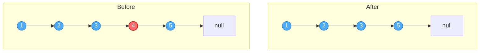
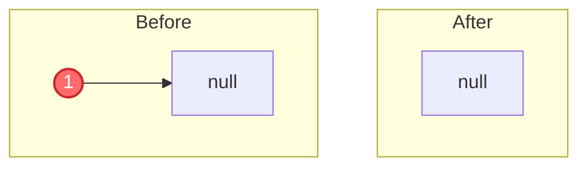
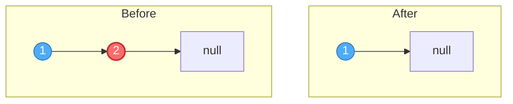
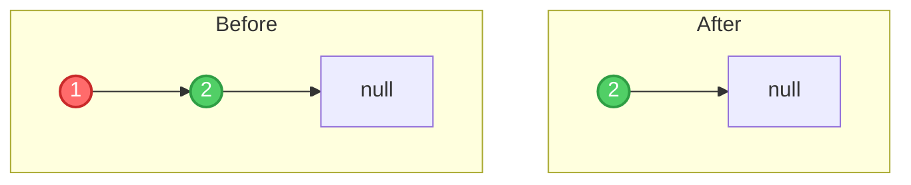
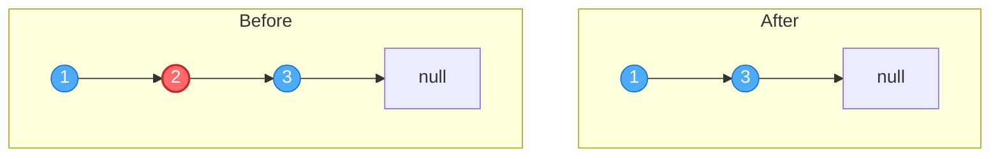
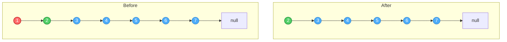
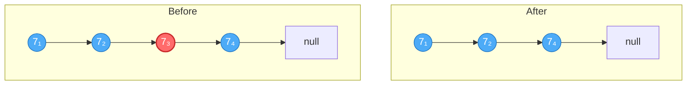

# Remove Nth Node From End of List

**Date added:** 2026-06-30

## Problem Description

Given the head of a linked list, remove the nth node from the end of the list and return its head.

**Source:** https://leetcode.com/problems/remove-nth-node-from-end-of-list/

## Examples

**Example 1 — interior node**
```
Input: head = [1,2,3,4,5], n = 2
Output: [1,2,3,5]
Explanation: The 2nd node from the end is 4 (at index 3). Removing it yields [1,2,3,5].
```


**Example 2 — single node, list becomes empty**
```
Input: head = [1], n = 1
Output: []
Explanation: The only node is also the 1st from the end. Removing it yields an empty list.
```


**Example 3 — remove the tail**
```
Input: head = [1,2], n = 1
Output: [1]
Explanation: The 1st node from the end is 2. Removing it yields [1].
```


**Example 4 — remove the head, new head emerges**
```
Input: head = [1,2], n = 2
Output: [2]
Explanation: The 2nd node from the end is 1 (the head). Removing it yields [2].
```


**Example 5 — odd-length list, exact middle**
```
Input: head = [1,2,3], n = 2
Output: [1,3]
Explanation: The 2nd node from the end is 2. Removing it yields [1,3].
```


**Example 6 — larger list, head removed again**
```
Input: head = [1,2,3,4,5,6,7], n = 7
Output: [2,3,4,5,6,7]
Explanation: n equals the list size, so the 7th node from the end is the head (1). Removing it yields [2,3,4,5,6,7].
```


**Example 7 — duplicate values, position matters**
```
Input: head = [7,7,7,7], n = 2
Output: [7,7,7]
Explanation: With sz = 4 and n = 2, the node to remove is at position (sz - n + 1) = 3 from the front.
Even though every value is 7, it's the 3rd node specifically that's unlinked, leaving three 7s: [7,7,7].
```


## Constraints

- The number of nodes in the list is `sz`.
- `1 <= sz <= 30`
- `0 <= Node.val <= 100`
- `1 <= n <= sz`

## Hints

1. If you knew the total length of the list, could you figure out which node (from the front) to remove?
2. Can you find the node to remove in a single pass without computing the length first?
3. Think about using two pointers that maintain a fixed gap between them.
4. If the fast pointer starts `n` steps ahead of the slow pointer, where are they relative to each other when fast reaches the end?
5. You need a reference to the node *before* the one you want to remove — how does that change where you start your slow pointer?
