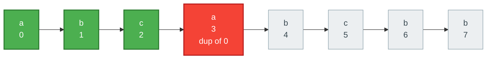
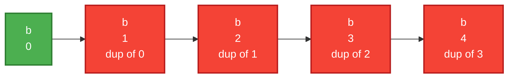
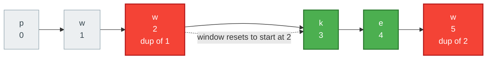
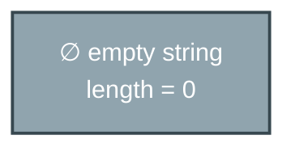
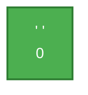
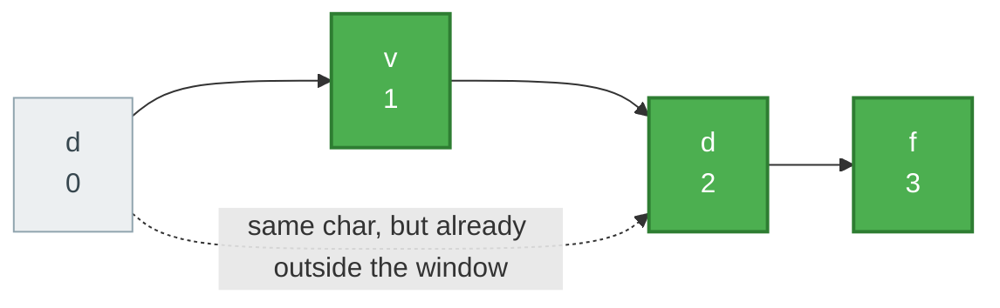
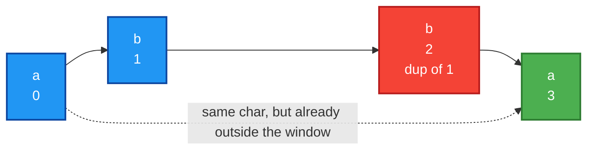

# Longest Substring Without Repeating Characters

**Date added:** 2026-09-19

## Problem Description

Given a string `s`, find the length of the longest substring without duplicate characters.

**Source:** https://leetcode.com/problems/longest-substring-without-repeating-characters/

## Examples

**Example 1**
```
Input: s = "abcabcbb"
Output: 3
Explanation: The answer is "abc", with the length of 3. Note that "bca" and "cab" are also correct answers.
```



**Example 2**
```
Input: s = "bbbbb"
Output: 1
Explanation: The answer is "b", with the length of 1.
```



**Example 3**
```
Input: s = "pwwkew"
Output: 3
Explanation: The answer is "wke", with the length of 3.
Notice that the answer must be a substring, "pwke" is a subsequence and not a substring.
```



**Example 4**
```
Input: s = ""
Output: 0
Explanation: The empty string has no characters, so the longest substring without repeating characters has length 0.
```



**Example 5**
```
Input: s = " "
Output: 1
Explanation: A single space is one character; a substring of length 1 trivially has no duplicates.
```



**Example 6**
```
Input: s = "dvdf"
Output: 3
Explanation: The answer is "vdf", with the length of 3. Notice that the 'd' at index 2 repeats
the 'd' at index 0, but index 0 has already fallen outside the current window, so it does not
force a shrink — this is the classic trap in this problem.
```



**Example 7**
```
Input: s = "abba"
Output: 2
Explanation: Both "ab" (indices 0-1) and "ba" (indices 2-3) are valid answers of length 2. The
'a' at index 3 repeats the 'a' at index 0, but index 0 is already outside the window by the time
we reach index 3 — a naive implementation that blindly resets the left pointer to the stale index
would compute the wrong answer here.
```



## Constraints

- `0 <= s.length <= 10^5`
- `s` consists of English letters, digits, symbols and spaces.

## Hints

1. A brute-force approach would check every substring for duplicates — what is its time complexity, and can work be reused as a window slides instead of restarting each check?
2. Think of a window `[left, right)` that expands one character at a time. What should happen when the incoming character already exists inside the current window?
3. A hash map (or a fixed-size array, since characters are bounded) can store the *last seen index* of each character for O(1) lookup.
4. When you find a duplicate, don't restart `left` from scratch — only move it past the previous occurrence, and **only if that occurrence is still inside the current window** (see the `"dvdf"` and `"abba"` examples above for why this matters).
5. Track the maximum window size (`right - left + 1`) as you go, updating it after every expansion.
