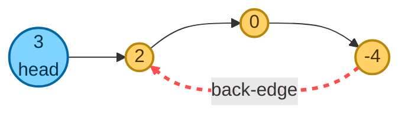
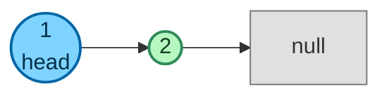
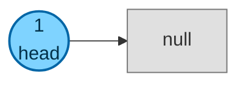
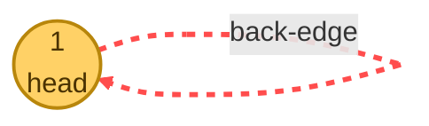
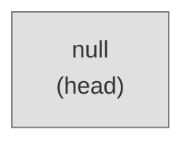
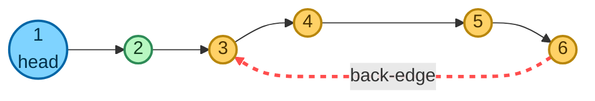
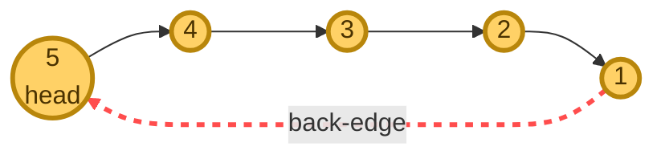

# Linked List Cycle Detection

**Date added:** 2026-09-19

## Problem Description

Given the beginning of a linked list `head`, return `true` if there is a cycle in the linked
list. Otherwise, return `false`.

There is a cycle in a linked list if at least one node in the list can be visited again by
following the `next` pointer.

Internally, `index` determines the index of the beginning of the cycle, if it exists. The tail
node of the list will set its `next` pointer to the `index`-th node. If `index = -1`, then the
tail node points to `null` and no cycle exists.

**Note:** `index` is not given to you as a parameter — it only describes how the test input is
constructed.

**Source:** https://neetcode.io/problems/linked-list-cycle-detection

## Examples

**Example 1**
```
Input: head = [3,2,0,-4], index = 1
Output: true
Explanation: The tail node (-4) connects back to the 1st node (0-indexed), which holds value 2.
```



**Example 2**
```
Input: head = [1,2], index = -1
Output: false
Explanation: The tail node points to null, so there is no cycle.
```



**Example 3**
```
Input: head = [1], index = -1
Output: false
Explanation: A single node with no cycle points directly to null.
```



**Example 4**
```
Input: head = [1], index = 0
Output: true
Explanation: A single node whose next pointer points back to itself forms a self-loop.
```



**Example 5**
```
Input: head = [], index = -1
Output: false
Explanation: An empty list has no nodes, so it trivially has no cycle.
```



**Example 6**
```
Input: head = [1,2,3,4,5,6], index = 2
Output: true
Explanation: Nodes 1 and 2 form a non-cyclic "tail" leading into the cycle, which starts at the
3rd node (0-indexed) holding value 3 and loops through 4, 5, 6 before returning to it.
```



**Example 7**
```
Input: head = [5,4,3,2,1], index = 0
Output: true
Explanation: The entire list is one big loop — the tail (1) connects back to the head (5), so
every node, including the head, is part of the cycle.
```



## Constraints

- `0 <= Length of the list <= 1000`.
- `-1000 <= Node.val <= 1000`
- `index` is `-1` or a valid index in the linked list.

## Hints

1. Think about what "revisiting a node" means while you traverse — what would you need to
   remember about the nodes you've already seen?
2. A hash set of visited node references would work, but it costs O(n) extra space. Can you do
   it with O(1) space instead?
3. Consider using two pointers that traverse the list at different speeds.
4. If a cycle exists, a faster-moving pointer will eventually "lap" a slower one and they'll
   land on the exact same node.
5. If the faster pointer (or its `next`) ever reaches `null`, the list has no cycle.
