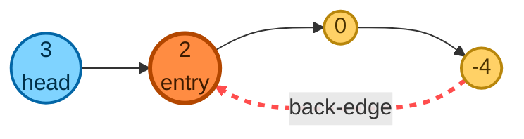
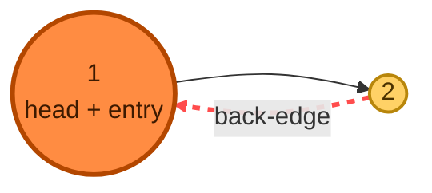
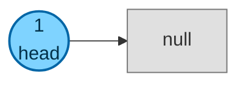
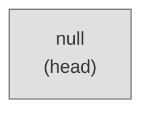
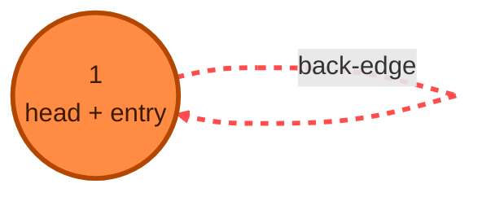
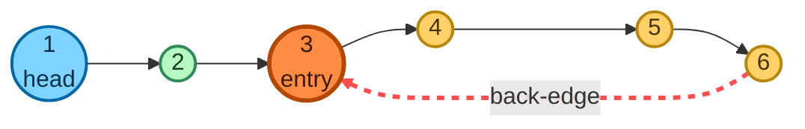
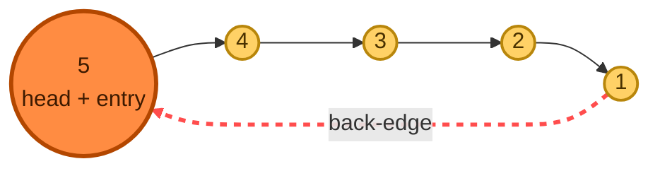

# Linked List Cycle II

**Date added:** 2026-09-20

## Problem Description

Given the `head` of a linked list, return the node where the cycle begins. If there is no
cycle, return `null`.

There is a cycle in a linked list if some node in the list can be reached again by continuously
following the `next` pointer. Internally, `pos` is used to denote the index of the node that the
tail's `next` pointer is connected to (0-indexed). It is `-1` if there is no cycle.

**Note:** `pos` is not passed as a parameter — it only describes how the test input is
constructed.

Do not modify the linked list.

**Source:** https://leetcode.com/problems/linked-list-cycle-ii/

## Examples

**Example 1**
```
Input: head = [3,2,0,-4], pos = 1
Output: node with value 2 (index 1)
Explanation: The tail node (-4) connects back to the 1st node (0-indexed), which holds value 2.
```



**Example 2**
```
Input: head = [1,2], pos = 0
Output: node with value 1 (index 0)
Explanation: The tail node (2) connects back to the head, so the cycle begins at the head itself.
```



**Example 3**
```
Input: head = [1], pos = -1
Output: null
Explanation: A single node with no cycle points directly to null.
```



**Example 4**
```
Input: head = [], pos = -1
Output: null
Explanation: An empty list has no nodes, so it trivially has no cycle.
```



**Example 5**
```
Input: head = [1], pos = 0
Output: node with value 1 (index 0)
Explanation: A single node whose next pointer points back to itself forms a self-loop, so the
node itself is the cycle's entry point.
```



**Example 6**
```
Input: head = [1,2,3,4,5,6], pos = 2
Output: node with value 3 (index 2)
Explanation: Nodes 1 and 2 form a non-cyclic "tail" leading into the cycle, which starts at the
3rd node (0-indexed) holding value 3 and loops through 4, 5, 6 before returning to it.
```



**Example 7**
```
Input: head = [5,4,3,2,1], pos = 0
Output: node with value 5 (index 0)
Explanation: The entire list is one big loop — the tail (1) connects back to the head (5), so
every node, including the head, is part of the cycle and the head is the entry point.
```



## Constraints

- `0 <= Number of nodes in the list <= 10^4`
- `-10^5 <= Node.val <= 10^5`
- `pos` is `-1` or a valid index in the linked list.

## Hints

1. Think about what "revisiting a node" means while you traverse — what would you need to
   remember about the nodes you've already seen?
2. A hash set of visited node references would tell you both *whether* a cycle exists and
   *where* it starts, but it costs O(n) extra space. Can you do it in O(1) space instead?
3. Two pointers moving at different speeds (Floyd's algorithm) can tell you *whether* a cycle
   exists — but they meet somewhere inside the cycle, not necessarily at its start.
4. Once the fast and slow pointers meet, think about the distance from the head to the cycle's
   entry versus the distance from the meeting point back to the entry — is there a relationship
   between them?
5. Try resetting one pointer to `head` after the first meeting, then advance both pointers one
   step at a time. Where do they meet the second time?
