# Reorder List

**Date added:** 2026-09-20

## Problem Description

You are given the `head` of a singly linked list. The list can be represented as:

```
L0 -> L1 -> ... -> Ln-1 -> Ln
```

Reorder the list to be on the following form:

```
L0 -> Ln -> L1 -> Ln-1 -> L2 -> Ln-2 -> ...
```

You may not modify the values in the list's nodes. Only the nodes themselves may be
rearranged (their `next` pointers changed).

**Source:** https://leetcode.com/problems/reorder-list/description/

## Examples

Each example shows the **input** chain and the **expected output** chain. Node colors mark
where each node came from: 🔵 **front half**, 🟠 **back half** (originally the tail, walked
backwards), 🟢 **unpaired middle node** (only appears for odd-length lists, and always lands
last in the output).

**Example 1** — classic even-length list
```
Input: head = [1,2,3,4]
Output: [1,4,2,3]
Explanation: Front half [1,2] interleaves with the reversed back half [4,3]: 1, then 4, then 2, then 3.
```

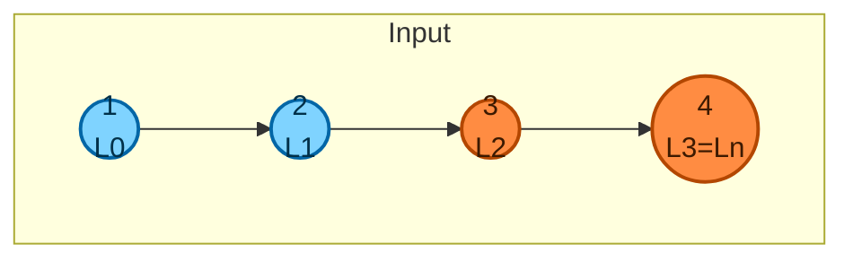

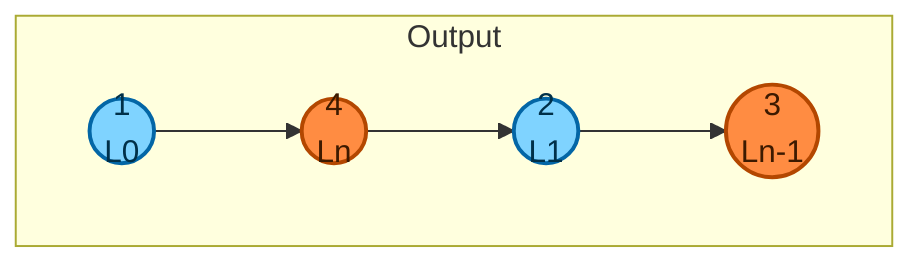

**Example 2** — classic odd-length list
```
Input: head = [1,2,3,4,5]
Output: [1,5,2,4,3]
Explanation: Front half [1,2,3] interleaves with reversed back half [5,4]; the unpaired middle node (3) lands last.
```

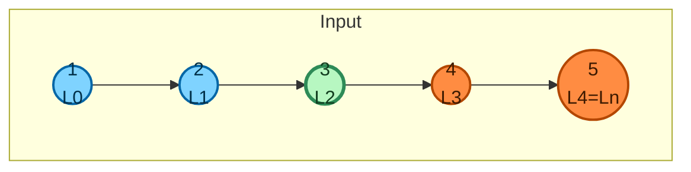

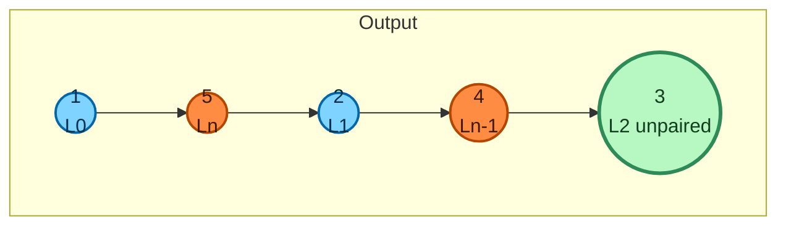

**Example 3** — single node (minimum length per constraints)
```
Input: head = [1]
Output: [1]
Explanation: A single node has no "back half" to interleave with, so it stays exactly as is.
```

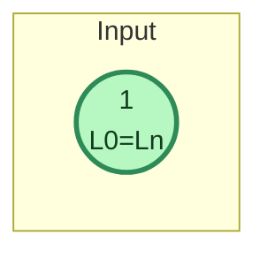

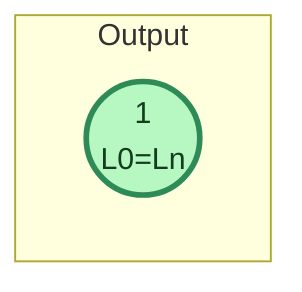

**Example 4** — two nodes
```
Input: head = [1,2]
Output: [1,2]
Explanation: With only L0 and Ln, the reordered form L0 -> Ln is identical to the original order.
```

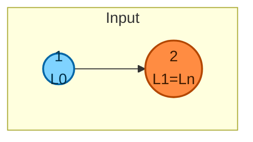

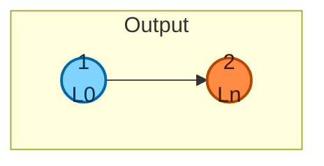

**Example 5** — three nodes (smallest odd case beyond a single node)
```
Input: head = [1,2,3]
Output: [1,3,2]
Explanation: Front half [1,2] pairs one node (1) with the reversed back half [3]; node 2 is the unpaired middle and lands last.
```

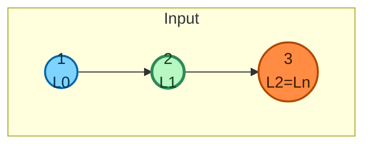

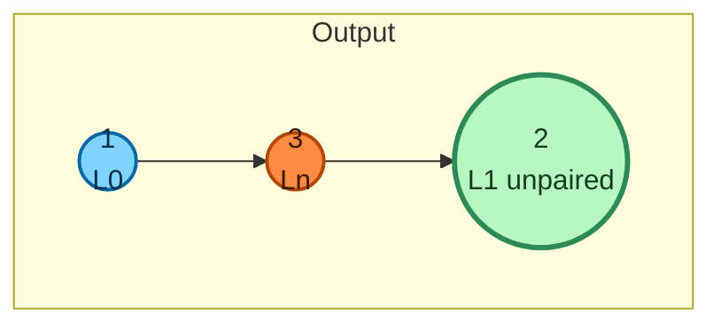

**Example 6** — duplicate values (six identical nodes)
```
Input: head = [7,7,7,7,7,7]
Output: [7,7,7,7,7,7]
Explanation: Every value is 7, so the output values look unchanged — but the node identities were fully rearranged (L0, L5, L1, L4, L2, L3), which is what the colors below make visible.
```

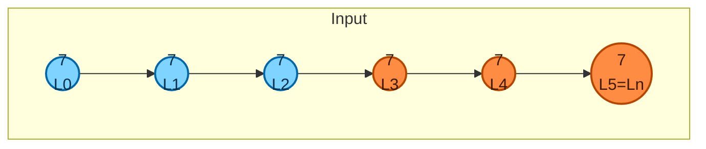

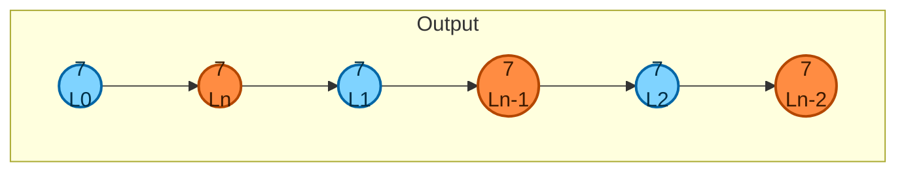

**Example 7** — boundary values (min `1` and max `1000` per constraints)
```
Input: head = [1,1000,1,1000,1]
Output: [1,1,1000,1000,1]
Explanation: Front half [1,1000,1] interleaves with reversed back half [1,1000]; the unpaired middle node (value 1) lands last.
```

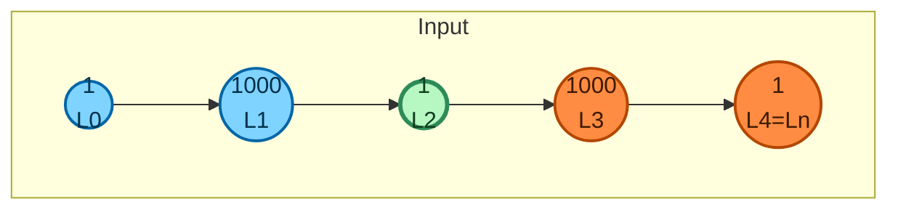

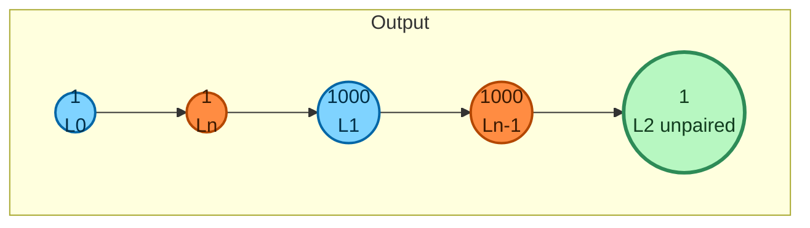

## Constraints

- The number of nodes in the list is in the range `[1, 5 * 10^4]`.
- `1 <= Node.val <= 1000`

## Hints

1. Think about what operations you'd need if you could freely access any node by index —
   but here you can only walk forward, one `next` at a time. What preprocessing could give you
   that kind of access from a singly linked list?
2. Try splitting the problem into three smaller, well-known sub-problems: finding the middle of
   a list, reversing a list, and merging two lists.
3. Fast and slow pointers can find the middle of a list in a single pass, without knowing the
   list's length ahead of time.
4. Once you have the middle, reversing the second half turns "grab nodes from the tail
   backwards" into "grab nodes from the front of a second list" — which is easy with a normal
   forward pointer.
5. Merge the two halves by alternating one node from each list at a time. Watch out for the
   `next` pointer of the last node in the (possibly longer) front half — it must not still point
   into the original second half, or you'll create a cycle.
