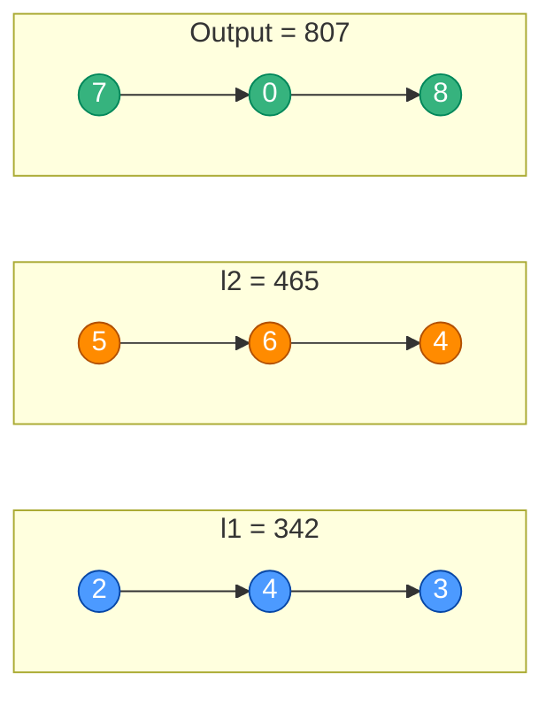
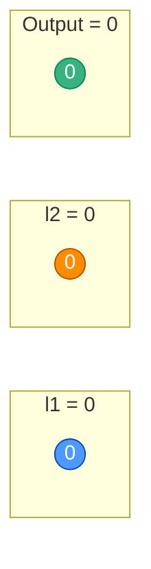
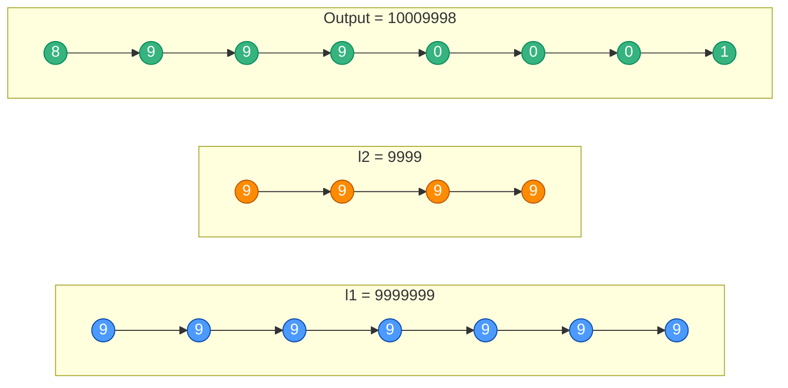
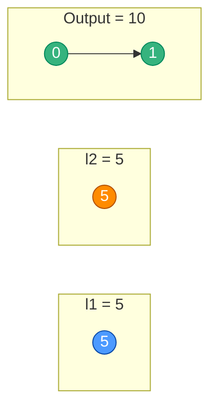
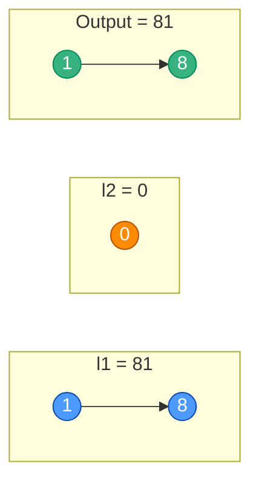
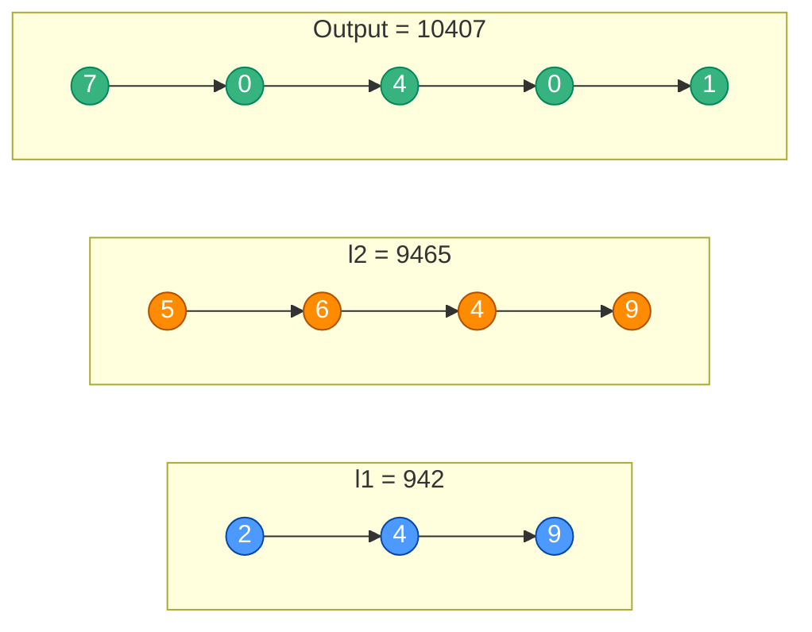
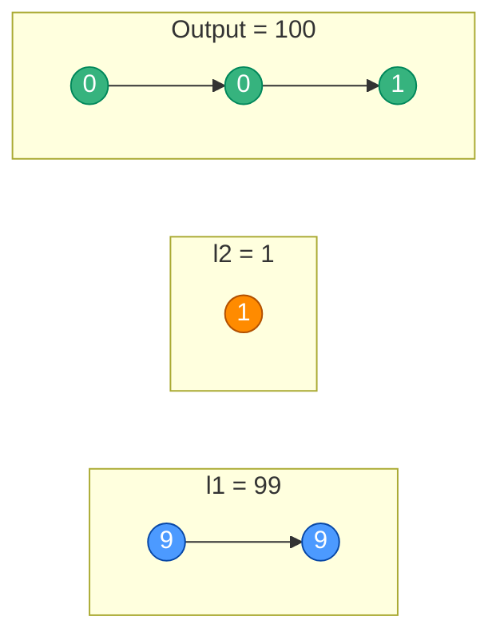

# Add Two Numbers

**Date added:** 2026-09-21

## Problem Description

You are given two non-empty linked lists representing two non-negative integers. The digits
are stored in reverse order, and each of their nodes contains a single digit. Add the two
numbers and return the sum as a linked list.

You may assume the two numbers do not contain any leading zero, except the number 0 itself.

**Source:** https://leetcode.com/problems/add-two-numbers/

## Examples

**Example 1**
```
Input: l1 = [2,4,3], l2 = [5,6,4]
Output: [7,0,8]
Explanation: 342 + 465 = 807.
```


**Example 2**
```
Input: l1 = [0], l2 = [0]
Output: [0]
Explanation: 0 + 0 = 0.
```


**Example 3**
```
Input: l1 = [9,9,9,9,9,9,9], l2 = [9,9,9,9]
Output: [8,9,9,9,0,0,0,1]
Explanation: 9999999 + 9999 = 10009998, stored in reverse order.
```


**Example 4**
```
Input: l1 = [5], l2 = [5]
Output: [0,1]
Explanation: 5 + 5 = 10, which needs a carry into a new node.
```


**Example 5**
```
Input: l1 = [1,8], l2 = [0]
Output: [1,8]
Explanation: 81 + 0 = 81. The shorter list (l2) is exhausted immediately but l1 still has digits left.
```


**Example 6**
```
Input: l1 = [2,4,9], l2 = [5,6,4,9]
Output: [7,0,4,0,1]
Explanation: 942 + 9465 = 10407. l2 is longer than l1, so addition continues after l1 is exhausted, plus a final carry.
```


**Example 7**
```
Input: l1 = [9,9], l2 = [1]
Output: [0,0,1]
Explanation: 99 + 1 = 100. Multiple consecutive carries ripple all the way through and produce an extra node.
```


## Constraints

- The number of nodes in each linked list is in the range `[1, 100]`.
- `0 <= Node.val <= 9`
- It is guaranteed that the list represents a number that does not have leading zeros.

## Hints

1. Think about how you'd add two numbers by hand, digit by digit, starting from the ones place — which end of each list does that correspond to?
2. Since digits are stored in reverse order, you can walk both lists simultaneously from their heads without needing to reverse anything first.
3. Keep track of a running `carry` value as you add corresponding digits together.
4. The two lists may have different lengths — what should happen when one list runs out of nodes before the other?
5. Don't forget the case where a carry remains after both lists are fully consumed; it needs to become one final extra node.
